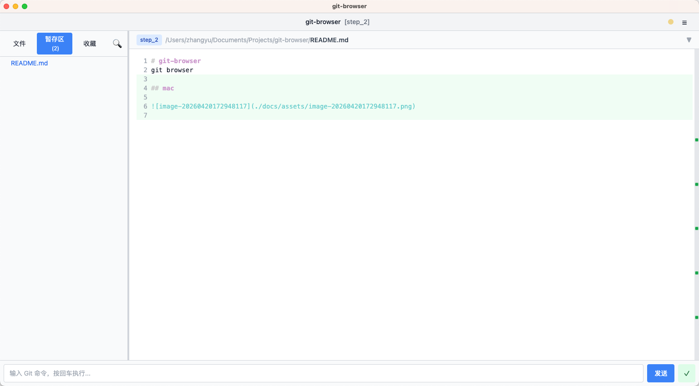

# 待开发功能

1. 中英切换
2. PRO版本（支持文件编辑，支持分支工作流）
3. win版本左上角没有系统按钮 √
4. 提供分支比对面板（与默认分支比对，与指定分支比对）
5. 在暂存区点击文件，右侧文件浏览应该能看到修改内容 √
6. 提供提交历史面板 √
7. 某些指令可以直接打开面板，比如git log，直接弹出一个面板并将结果输出到面板中，git status同理 √
8. AI总结（git提交内容总结，变更比较总结，代码审查等）
9. 项目名面板应该展示的是当前项目路径及项目名（无需再展示分支名，与文件名区重复，二者取其一） - **保留当前实现：路径 + 分支**
10. 点击项目名可以切换项目，要求.git目录（通过本地的git功能，不依赖api） √
11. 代码合并请求处理，依赖于接口（PRO）
12. 按钮功能（推送，拉取，比对，合并）功能未实现，指令未考虑合并及冲突处理情况
13. 比对设置基准分支后，根据文件内容比对，不根据git的指令进行比对
14. 多分支并存（PRO）
15. 

## 已修复问题

- ✅ 文件改动频繁时，暂存区数量与实际数量不匹配 - **已修复：gitStatus 变化时重新加载文件列表**
- ✅ 命令模式下，所有命令结果均应以弹窗显示 - **已修复：除 git log/git branch 外，所有命令弹窗显示**
- ✅ `git commit` 不带 `-m` 参数时，弹窗提示输入提交信息 - **已实现**
- ✅ `git push` 没有显示推送结果，页面卡住 - **已修复：同时捕获 stdout+stderr，添加 5 分钟超时**
- ✅ 命令执行中，避免页面假死，显示 loading，禁止重复执行 - **已实现**
- ✅ `git add .` 执行成功无输出时空弹窗 - **已修复：显示"命令执行成功，无输出"提示**
- ✅ 命令行始终可直接输入，无需点击激活焦点 - **已实现：自动聚焦 + 全局点击保持焦点**
- ✅ 标题栏点击项目路径可以切换仓库 - **已实现**
- ✅ 切换仓库后，命令行仍使用旧路径 - **已修复：通过 props 传递 repoPath**
- ✅ 项目名改为左对齐 - **已完成**
- ✅ 命令执行中，发送按钮文字不变，右侧显示执行中 emoji - **已完成**

问题待处理：

