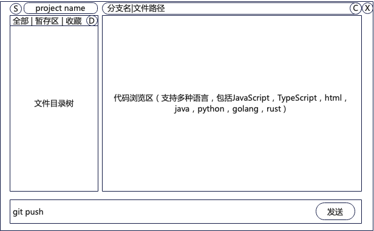
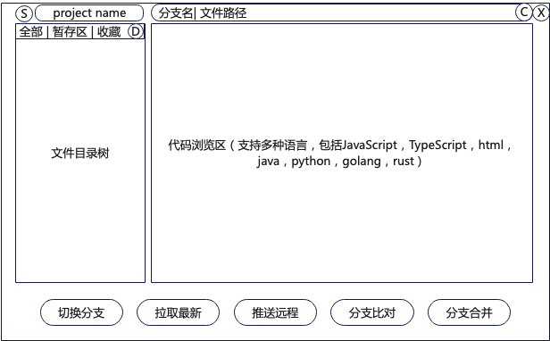
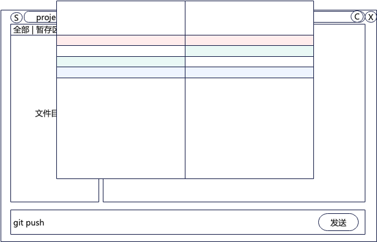

# git-browser UI设计

## 项目概述

git-browser 是一个极简的Git图形化桌面客户端，专注于代码浏览和日常Git操作。

设计理念：保持简洁易用，不追求覆盖所有Git高级功能，只满足日常开发80%的常见需求。

## 整体布局

整体采用三段式布局：顶部标题栏 + 主体内容区 + 底部操作区。

布局细节：
- 顶部标题栏：左侧S按钮(设置) + 中间项目名称显示 + 文件全路径名称 + 右侧X按钮(关闭退出)
- 主体内容区：左侧文件目录树 + 右侧代码浏览区，分隔栏支持拖动调整宽度
- 底部操作区：根据模式不同显示命令输入框或功能按钮
- 窗口支持自由缩放，各区域自适应大小

## 文件目录树

功能特性：
- 显示当前仓库的完整文件目录结构
- 默认显示隐藏文件（.开头的文件/目录），可在设置中勾选是否隐藏
- 整个目录树可折叠隐藏，获得更大的代码浏览空间
- 点击文件：在右侧代码浏览区打开该文件
- 双击目录：展开/折叠目录
- 不支持文件写操作，仅支持版本管理
- 支持文件名模糊搜索定位
- 任何Git操作都会实时更新目录树的展示状态
- 可以切换目录类型，全部、暂存、收藏

### 单目录模式和多目录模式

通过配置确认是单还是多

单目录模式，只有一个目录，一个分支，通过按键切换。

多目录模式，可以同时拉取多个分支到本地，生成多个目录（切换只是换目录，不切换目录本身内容）

## 代码浏览区

功能特性：
- 展示选中文件的代码内容
- 支持语法高亮，覆盖主流编程语言：JavaScript、TypeScript、HTML、CSS、Java、Python、Go、Rust、C/C++、Bash等
- 左侧显示行号，可在设置中关闭
- 支持横向和纵向滚动
- 支持在当前文件内搜索关键词
- 支持选中代码复制到剪贴板

## 按钮说明

S: 设置，配置相关选项

D: 定位，可以将当前展示的文件在目录中定位

C: 收藏，将当前文件收藏，在收藏区可看

发送：发送指令

## 工作模式

支持两种工作模式，可在设置中切换，也可通过快捷键快速切换。

### 命令模式

- 底部显示命令输入框
- 用户可以输入任意Git命令
- 点击「发送」按钮或按回车执行
- 执行成功显示绿色状态对号，执行失败显示红色状态叉，报错信息以弹窗提示，弹窗内容可复制

### 按键模式

- 底部显示常用Git操作按钮
- 默认包含：`切换分支`、`拉取最新`、`推送远程`、`分支比对`、`分支合并`
- 点击按钮后弹出对应操作的选择/确认界面

## 设置面板

点击左上角S按钮打开设置面板，包含以下配置项：

### 凭证配置
- SSH Key 管理：添加、删除、选择默认SSH Key
- HTTP 凭证管理：添加、删除远程仓库的用户名和密码

### 显示设置
- 是否显示隐藏文件（.开头）
- 是否显示代码行号
- 主题选择：亮色模式 / 深色模式

### 模式设置
- 选择默认启动模式：命令模式 / 按键模式

### 安全性
- 按键模式下需要安全确认
- 推送远程，分支合并，提交前需要用户确认

## Git操作与状态标记

任何Git操作，都会对文件目录树的展示产生影响。文件状态颜色标记规则：

- 新增文件：文件名标记为**绿色**
- 删除文件：文件名标记为**红色**
- 修改文件：文件名标记为**蓝色**
- 文件冲突：文件名标记为**橙色**

## 主要操作流程

### 查看变更
- 已修改文件在目录树中按颜色标记
- 目录树提供选项只展示暂存区的内容
- 点击文件可在右侧查看当前内容，diff对比通过左右两个标签页展示

### 提交 Commit
- 左侧勾选要提交的文件
- 输入Commit message
- 点击提交按钮完成

### 切换分支
- 点击「切换分支」按钮弹出分支列表
- 只展示本地有的分支，不必展示远程
- 点击目标分支完成切换

### 查看 Commit 历史
- 打开独立面板展示commit历史列表
- 显示commit hash、作者、时间、message
- 点击可查看该commit的详细变更
- 只显示当前分支提交记录

### 对比 Diff
- 选择两个commit或两个分支进行对比
- diff结果展示在右侧区域，按文件分组展示变更
- 对比逻辑按照文件内容差异，不按照git提交

### 拉取/推送
- 点击对应按钮直接执行
- 执行完成后弹窗展示执行结果
- 失败时显示错误信息便于排查

### 解决冲突
界面如下图

- 弹窗显示两个版本的对比内容，原窗口在一个窗口中展示两个版本的不同内容（即弹窗使用左右对比视图，原窗口使用同页面比对视图）
- 两个版本中的比对视图参考一般设计，通过鼠标选择使用哪个版本。
- 如果存在未处理的冲突，关闭窗口前提示

## 状态反馈

- 当前分支名称显示在标题栏项目名称后方
- 有未提交变更时，在标题栏显示指示器提醒用户
- 长时间操作进行中显示加载指示器
- 操作结果通过弹窗反馈：成功提示/错误提示

## 安全性设计

- 凭证存储：SSH Key路径和HTTP凭证加密存储在本地配置文件
- 危险操作保护：默认开启二次确认，避免误执行破坏性操作

## 性能考虑

- 大代码文件自动启用懒加载，避免长时间卡顿
- 文件目录树虚拟化渲染，支持大型仓库流畅展示